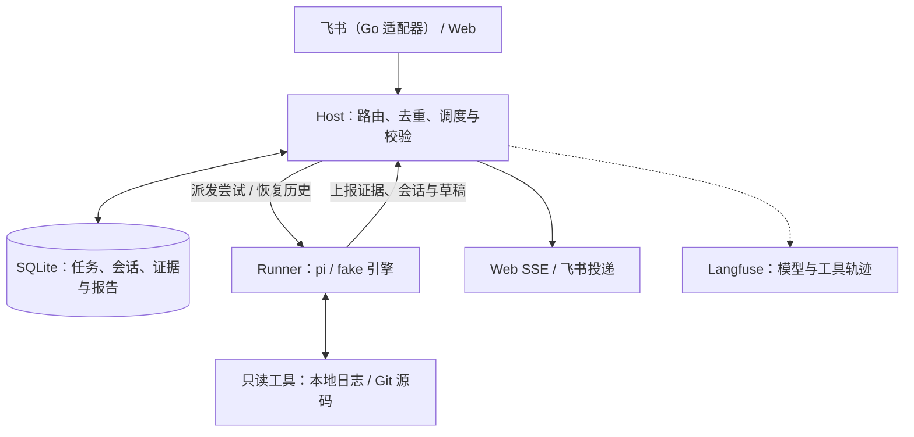

# ticket-doctor

## 项目介绍

ticket-doctor 是面向测试与开发的 **Bug 预诊断 Agent**。提交故障描述后，
Agent 查询日志、检索源码，整理异常线索与根因候选，输出带证据引用的报告，
帮助开发接手排查；材料不足时追问，补充后继续同一调查。

项目聚焦只读取证与预诊断，**关键在于将判断前置，让开发接手时更快定位问题，解决bug更高效**。
最终根因由开发确认。

## 核心功能

### 问题接入与进度查看

支持飞书、钉钉等多种IM平台与 Web 提交问题，自动创建或续接调查；Web 时间线展示消息、执行进度与结果。

### 日志与源码取证

按照提前制定好的清单排查，查询已配置的本地服务日志，定位源码中的相关文件与代码上下文，
将故障描述与实际材料关联起来。
检索工具可根据实际业务场景进行调整。

### 多轮追问与补证

材料不足时提出具体补充问题。用户继续原调查后，Agent 读取已保存历史，
结合新材料继续排查，证据编号在调查内保持可追溯。

### 带证据的预诊断报告

报告包含事实、根因候选、证据引用、不确定项、缺失材料与下一步，
通过 Web 展示或回写飞书，供开发继续验证。

### 模型与工具过程复盘

接入 Langfuse，查看捕获到的模型输入输出、工具参数与返回、耗时和 Token 用量，
定位检索、模型调用与报告校验过程中的问题。

## 工作原理

推荐采用 **Go 接入适配器 + Host + 独立 Runner** 的单机多进程架构：
Host 管理接入、调度与持久化，每次执行尝试启动一个 Runner，通过 NDJSON 协议交互。



一条消息依次经过 **接收与路由 → 持久化入队 → 领取执行 → 逐步取证 → 校验提交 → 展示或投递**；
用户补充材料后进入下一轮。

### 可靠调度与执行隔离

同一调查按轮次串行，不同调查并行。Host 通过租约、心跳、超时回收与有限重试处理执行中断；
每次领取递增 `generation`，在数据库事务中拒绝旧执行者提交证据和报告。
这类机制参考 [Union 的租约设计](https://www.union.ai/blog-post/inside-union-leases-the-scheduling-engine-behind-flyte-2)
与 [Fencing Token](https://martin.kleppmann.com/2016/02/08/how-to-do-distributed-locking.html)。

### 单库持久化与会话恢复

面向单机部署，选择 SQLite 统一保存业务状态、模型会话与证据，由 Host 集中写入，
避免业务库与会话文件双写不一致。借鉴 pi durable 的恢复思路，
通过 pi SessionManager 重建已保存上下文：已提交证据可用于恢复工具返回，
未决结果标记为未知，已保存的本轮输入不会重复追加。

### 从检索到证据

Runner 准备检索时间窗，并将源码版本解析为固定 Git SHA。本次尝试都检索同一代码快照，
诊断工具不会逐任务 clone 或 pull 仓库；当前来源为本地日志与已有 Git 仓库。

模型按线索调用 `query_logs`、`list_files`、`search_code` 与 `read_code`，
逐步定位问题。工具先提交证据，Host 保存并签发 UID 与调查内 `E#` 后才返回模型。
材料不足时调用 `request_info` 追问，完成诊断时调用 `submit_report` 提交草稿。

### 报告校验、投递与观测

Host 校验引用与报告结构，将报告、执行终态和待发送记录在同一事务提交。
发送失败单独处理，避免投递故障触发重复模型诊断；发送结果无法确认时保留不确定态。

Langfuse 通过 OpenTelemetry 关联调查、执行尝试、模型、工具与报告校验。
观测默认关闭，导出为 best-effort；会话恢复依赖 SQLite，观测失败不阻塞业务提交。

## 快速开始

需要支持 `node:sqlite` 与 `--experimental-strip-types` 的 Node.js，以及 Git。

```bash
npm ci
npm run demo
```

默认 demo 使用 fake 引擎、样例日志和仓库，跑通消息、取证、报告与假投递闭环，
并初始化样例 Git 仓库。若已有 `.env`，检查 `TD_ALLOWED_SERVICES`：
显式空值会拒绝全部日志查询，样例应填写 `checkout-service`。

### 启动 Web 与独立 Runner

复制 [.env.example](.env.example) 为 `.env`，将以下配置写入后运行 `npm run host`：

```dotenv
TD_ENGINE=fake
TD_RUNNER_MODE=process
TD_FEISHU_DIRECT=false
TD_REPOS=app:./fixtures/demo-repo
TD_ALLOWED_SERVICES=checkout-service
```

打开 `http://localhost:3000/`。调用真实模型需设置 `TD_ENGINE=pi` 与对应提供商凭据；
使用实际材料时替换仓库、日志目录与服务白名单。

飞书接入见 [Go 适配器说明](adapters/go/README.md)：单独运行 Go 时需要注入环境变量，
它不会自动读取根目录 `.env`。也可使用 [Docker Compose](docker-compose.yml)，
将 `.env` 中 `TD_DB_PATH` 改为 `/data/ticket-doctor.sqlite`，使数据库保存在持久卷中；
填写 Go 适配器使用的 `LARK_*` 凭据，并按需替换源码与日志挂载。

### 工程检查

```bash
npm test
npm run typecheck
npm run docs:check
npm run test:go
```

Go 检查需要 Go 环境。Langfuse 的启用、部署与验收见 [观测手册](docs/self-host-langfuse-runbook.md)。

## 当前状态

| 能力 | 状态 |
|---|---|
| 接入、调度、恢复、取证、报告与投递 | 工程闭环已实现，fake demo 可运行 |
| 真实模型与 Langfuse | 已有真实模型样例观测验收，未建立当前版本可复现的诊断质量基线 |
| 检索来源 | 本地文件日志与 Git；远程日志、生产诊断 MCP 与仓库同步器待建设 |
| 质量评测与独立审计 | 已有评测方案；数据集、评分、实验、CI 门禁与独立审计 Agent 尚未接入 |
| RSI 改进闭环 | 方案阶段：优化提示词、规则与授权范围内检索参数，人工批准发布 |
| 接入与访问控制 | 飞书长连接待真机验收；Web 无登录与权限体系；钉钉/Slack 为骨架，图片未接入 |

程序校验引用有效性不等于确认根因。旧评测 harness 已移除，历史成绩不代表当前质量；
工程 demo 与样例观测也不等同于生产诊断验收。

<details>
<summary>检索与运行的当前边界</summary>

- 调查的服务与时间窗尚未用于强制授权校验，日志接口没有环境隔离字段。
- 显式 `TD_REPOS` 尚未与 `TD_ALLOWED_REPOS` 强制取交集；只读能力不代表完整授权隔离。
- 来源缺少分页与覆盖信息，`read_code` 的统一总输出预算、`TD_MAX_MODEL_TURNS` 强制执行仍待补齐。
- SHA 在每次尝试准备时解析，同轮重试的固定版本机制尚未补齐；按发生时间选提交不等于确认部署版本。
- Langfuse 观测可能截断或丢失，统一脱敏尚未实现；会话恢复以已保存内容为准。

</details>

## 详细文档

- 使用与接入：[产品使用](docs/usage.md)、[Go 适配器](adapters/go/README.md)。
- 架构与接口：[Host/Runner](docs/host-runner-design.md)、[接口协议](docs/interface.md)、[并发设计](docs/concurrency.md)。
- 会话与证据：[会话持久化](docs/session-log-design.md)、[证据 UID 与恢复](docs/evidence-uid-design.md)、[材料范围](docs/evidence-scope-design.md)。
- 观测与评测：[Langfuse 手册](docs/self-host-langfuse-runbook.md)、[规则迭代协议](docs/evolve-protocol.md)。
- 工程与进展：[代码导航与开发入口](docs/contributor-onboarding.md)、[功能状态](docs/status.json)、[路线图](docs/roadmap.md)。

设计文档中的历史路径与命令需要结合当前代码核对；规划能力以“当前状态”为准。
