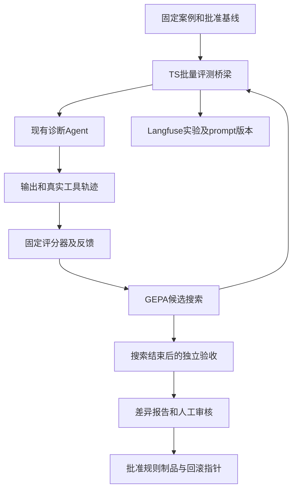

# ticket-doctor 自改进实施方案：GEPA 起步，预留 Dream-RSI 历史回放

> 调研日期：2026-10-09。状态：技术设计及本地案例材料草稿；优化器、评分器、发布入口均尚未实现，未运行真实模型实验。
> 本轮交付本文及独立案例包，不修改诊断 Agent。已有预诊断方案、业务代码及其他工作树保持原状。

## 1. 先读这一页

目标是：运行一次受预算约束的实验，得到候选诊断规则、逐案例效果变化、失败原因、成本及采用建议；人工审核后发布，并可回滚。如果没有可靠提升，输出“保留基线”。

第一版选 **GEPA + 现有 TypeScript Agent + Langfuse**。改进对象只允许是外部诊断规则；固定基础 prompt、工具、Agent 核心、案例、答案和评分器不参与自动修改。

Dream-RSI 留作第二阶段。先保存候选树和成本，后续研究如何更有效地分配探索预算。现在没有历史树，先实现历史回放没有可评的数据。

首批已选择并保存 **9 个 RootCauseBench 冻结案例**，分为 4 个训练、3 个验证、2 个保留案例，覆盖不同故障家族。它们是公开模拟／重建材料，不能代表真实生产效果；目前未人工审定、未导入 Langfuse、不能直接交给现有 CLI 运行。

案例包：[说明](../fixtures/research/rsi-bootstrap/README.md)、[来源与哈希清单](../fixtures/research/rsi-bootstrap/manifest.json)。

可验证目标：

| 目标 | 验收结果 |
|---|---|
| 材料可重复 | 同一 source commit、公开材料、私有标准、转换器、模型配置、评分器及规则版本均可追溯；hash 不同拒绝比较 |
| 候选确实被执行 | 记录完整 prompt 的版本及 hash，并核对实际请求；不能只相信注册成功 |
| 反馈可信 | 逐案例输出分数和证据定位；缺测不充当通过；不把“漏召回”“已召回但推理错”“材料缺失”混为一类 |
| 改进可审查 | 基线、候选用同一材料与评分重复运行；展示改善、退化、硬失败和成本，不只报均值 |
| 发布独立 | 搜索结束产生待审制品；批准后生产入口才加载该版本；实验本身不发布 |
| 可恢复 | 每轮候选、父候选、接受／拒绝原因落盘，预算中止后可续跑；生产可回到上一批准版本 |

已确认的范围沿用此前讨论：ticket-doctor 预诊断 Agent；自动生成并评测候选，人工审核后发布。用户授权选择案例和材料，因此本轮无需另问来源或分布偏好。以下预算、权重及筛选阈值是**初始设计建议**，需在发布政策中审定，不能当作已批准的生产门禁。

## 2. Dream-RSI 与 GEPA 的关系

二者都通过反馈、反思、候选修改及评估择优进行搜索。GEPA 也能优化代码和调度策略，不能简单划成“GEPA 只能改 prompt，Dream-RSI 只能改调度”。[GEPA 作者仓库](https://github.com/gepa-ai/gepa)

Dream-RSI 的特色是：固定底层 Agent 和评测器，改探索策略，并在历史发现树上回放比较。它调整继续哪条分支、并发多少及何时停止；回放只能逐步揭示已有结果，不能产生历史外结果。历史回放分数改善不保证下一轮真实探索改善。[论文 v2 第 3 节](https://arxiv.org/html/2609.14858v2#S3)

| 对比 | 本项目第一版 GEPA | 后续 Dream-RSI inspired 扩展 |
|---|---|---|
| 主要修改对象 | 诊断规则文本 | 候选搜索的预算分配策略 |
| 主要评测 | 新规则执行 Agent 后的真实结果 | 历史树中可回放的调度结果，再做在线验证 |
| 主要收益 | 诊断质量改善 | 同预算下更高质量，或同质量下更少调用 |
| 当前条件 | 有固定案例及可信评分后可以启动 | 先积累完整候选历史，才有回放素材 |

截至调研，Dream-RSI 作者仓库仍将完整代码和复现脚本标为准备中。本文第二阶段是自建扩展，不能称为官方实现或论文复现。[发布状态](https://github.com/zhengkid/Dream-RSI#release-plan)

## 3. 当前仓库能复用什么

本节是只读核查时点，不表示分支已合并。

- 当前 main：`b6e754b978dbe5e639d6b4404fc90ff859dd6e25`。
- Langfuse eval 已提交分支：`724a9bf4c75f77dd80763c8d3448abffd9ad6199`。
- SDK migration 工作树基于上述 eval commit，存在未提交迁移；它不是另一个已完成合并的版本。
- 原预诊断文档依据更早的源码时点，实施时以实际代码复核；不直接照搬旧文件路径。

| 能力 | 已有位置 | 实施处理 |
|---|---|---|
| 单案例诊断 | main 的 `src/eval/runner.ts`：`runCase` | 可复用诊断核心；它不覆盖正式持久化及投递 |
| 基础 prompt 加规则 | `src/agent/pi-engine.ts`：`buildSystemPrompt(rules?)` | 固定基础部分，仅候选规则可变 |
| prompt 注入 | `src/agent/factory.ts`：`buildEngine(config, systemPrompt?)` | 已有注入口，无需复制 Pi 工具循环 |
| 多轮正式链路回放 | eval 分支 `src/eval/lf/run-case.ts` | 优先复用，多轮、独立状态、捕获发送端均已有 |
| Langfuse 实验 task | eval 分支 `src/eval/lf/task.ts`：`makeTicketDoctorTask` | 作为 batch evaluator 的业务桥梁 |
| prompt 版本 | eval 分支 `src/eval/lf/prompt.ts` | 复用候选注册、按数字版本读取、compiled/hash |
| 真实反馈材料 | eval 分支 `src/eval/lf/internals/trace.ts` | 整理工具返回、错误、证据及引擎输出，不凭空生成轨迹 |

[eval 分支固定源码](https://github.com/5quan/ticket-doctor/tree/724a9bf4c75f77dd80763c8d3448abffd9ad6199/src/eval/lf)

必须补齐的缺口：

1. 当前 Langfuse seed 主要生成固定工程自测；需要通用案例导入、准入及 split 选择。
2. 当前工程 evaluator 不等于可信的诊断语义评分，人工 review 不能自动变成优化器的连续反馈。
3. task 返回的汇总不是完整中间轨迹；需要消费本地 trace／artifacts 或返回控制器专用引用。
4. `verify` 检查落库关联与实验完整性，不是候选相对批准基线的质量门禁；实验执行成功也不等于高质量。
5. 生产仍可能使用内置 prompt。**仅改 Langfuse 的 production 标签，不能让当前生产 Agent 自动采用候选。**发布阶段必须明确把批准的 prompt 传给已有引擎入口。

实施前先选定、整合 eval 与 SDK migration 的代码基线，并记录 commit 和工作树补丁 hash。整合由后续开发任务完成；不要混用 main、eval 工作树及未提交迁移的功能清单。

## 4. 无案例时，先用哪些材料

### 4.1 本轮已准备的案例

来源为 RootCauseBench，固定仓库 commit：`c2f9b4aae67b092803c7c7d85e3e27facb528f0f`，许可证 Apache-2.0。保留原始遥测、变更记录、oracle 及许可；中文任务仅由公开告警字段派生。[原始结构与来源说明](https://github.com/edgedelta/root-cause-bench/blob/c2f9b4aae67b092803c7c7d85e3e27facb528f0f/datasets/rootcausebench/README.md)

| 中性编号 | split | 官方案例 | 要检查的诊断能力 |
|---|---|---|---|
| rcb-001 | train | payment-nil-deref-panic | 分辨出错组件与下游受影响组件，核对空值保护变更 |
| rcb-002 | train | checkout-latency-n-plus-one | 结合调用／查询证据判断放大效应，排除临近无关部署 |
| rcb-003 | train | inventory-connection-pool-exhaustion | 延迟发生的容量问题，不直接归罪最后一个变更 |
| rcb-004 | train | auth-jwt-validation-regression | 对照实际失败与校验逻辑，避免只根据错误关键词下结论 |
| rcb-005 | validation | recommendation-memory-leak | 区分资源增长的机制与表面告警 |
| rcb-006 | validation | grpc-deadline-too-tight | 区分上游预算不足与下游服务故障 |
| rcb-007 | validation | dashboard-db-schema-missing-table | 区分业务代码引用与数据库实际结构 |
| rcb-008 | holdout | payment-refund-poison-batch | 外部数据问题可以没有罪魁代码提交，不强行选择 commit |
| rcb-009 | holdout | tls-cert-expiry | 核对证书与时间证据，不把运维制品问题强制解释为代码故障 |

训练只给优化器训练材料和失败反馈；验证用于搜索择优，其反馈仍会间接影响搜索；保留集只在搜索结束后验收。保留集失败后不得把答案回传继续修同一轮候选；需换一轮实验并重新安排独立保留材料。

split 按故障家族划分。同一事故的改问法、删材料、补材料或多轮变体，必须跟原案例处于同一 split。初始 9 个家族各一例，仅够验证流程及发现明显退化；不能据此声称统计稳定的泛化提升。

### 4.2 材料实际包含什么

每例保存公开 `alert.json`、`logs.ndjson`、`metrics.csv`、`traces.json`、`patterns.json`、提交 diff、部署及 feature flag；私有目录保存原始 oracle。清单还记录源 URL、文件字节数、SHA-256、上游 Git blob hash 和派生问题的转换说明。

注意：这里的应用 commit ID 是虚构案例标识，`commits.json` 只含变更片段。它们**不是完整源码 Git checkout**，不能用来评价真实代码 SHA 核验、全仓库源码检索或修复可运行性。冻结的真实 Git 版本是 benchmark 材料仓库的版本。

案例目录名使用中性编号。manifest、上游 README、私有 truth、训练／验证／保留集目录映射都只供控制器及评分器使用，不能整份传给被测 Agent。

### 4.3 适配现有工具，避免偷偷换考题

当前 `FileLogSource` 接受每服务一个 `.log` 文件，每行 `timestamp<TAB>level<TAB>message`；直接放入 NDJSON 会被忽略。

第一项开发工作是保真的材料转换器。**首个模型基线明确采用日志-only：**提交 diff、部署、flags、metrics 和 traces 先存档，尚未开放读取的内容不参与评分；commit 定位、diff 根因及精确指标项记 N/A。先检验服务定位、日志证据、直接原因及有效补证，再扩展材料能力。

- 按原 service 分文件；原 timestamp、severity、msg 原样保留，把 trace ID、route 及其他字段附入消息；记录原始文件和行号映射。
- 变更 diff、部署及 flags 保留为“变更资料附件”，明确它们是版本变更记录，不伪造为服务运行日志，也不声称是完整源码证据。当前工具没有附件读取入口，保存了附件不代表 Agent 已经读到。
- 允许判断深度跟实际可见材料一致，不能要求 Agent 根据不可见附件得出根因。日志-only rubric 不沿用上游 commit 命中分数。
- 全量 RCA 轨道拟新增固定的只读 `readCaseMaterial(caseId, fileRef, lineRange)` 适配入口，返回原文件 hash、原始行／字段定位、截断标记及内容；同时让报告引用和评分能解析这类文档来源。读取白名单、引用协议是 A 交付的工程工作，不能把片段冒充 codeRef 或默认现有工具支持。完成后冻结新的工具／材料基线，再启动搜索；不能把新增材料的提升归功于规则优化。
- 所有转换在 Agent 运行前完成，结果随版本冻结；禁止优化器编辑转换后的资料。

告警触发时间不等于故障发生时间。任务草稿把 alert.fired_at 保存为 receivedAt／alertFiredAt，occurredAt 暂为 null；只有公开证据核实发生时间后才赋值。每例服务白名单由实际公开材料生成；跨服务可查询，但不能访问其他 case。时间窗、分页及截断保持可审计，不因为固定的告警附近短窗口而隐藏延迟故障的早期证据。

推荐先以 rcb-001、rcb-004 的训练日志验证接入，再在 rcb-007 上检查验证流程，最后扩到 9 例及变更材料轨道。训练资料制作并冻结评分器，验证和保留材料不能充当评分调试反例。

### 4.4 下一批：验证完整源码能力

选择 BugsInPy 的 FastAPI 7 为第一个历史故障候选，FastAPI 12、5 后续补充。它们提供历史版本和触发测试，适合采集“请求／测试输入 → 错误或响应 → 故障源码”的材料。沿用已有预诊断文档的候选方向，但必须重新核实、复现和审定。[BugsInPy 作者仓库](https://github.com/soarsmu/BugsInPy)

FastAPI 7 已有来源入口：[元数据](https://github.com/soarsmu/BugsInPy/blob/master/projects/fastapi/bugs/7/bug.info)、[触发测试](https://github.com/soarsmu/BugsInPy/blob/master/projects/fastapi/bugs/7/run_test.sh)。制作人员按历史依赖，在故障及已修复版本跑同一触发输入，保存完整 SHA、环境锁、原始输出和复现命令。

未复现前状态为 candidate；不补造日志，不把原 Issue 日志默认绑定到另一个 SHA。修复版本和触发器只供制作及评分，不能交给诊断 Agent。FastAPI 同项目候选不能随意分散到不同 split；正式划分时按项目及故障机制审查相似性。

## 5. 固定测试环境，先固定材料，再考虑完整沙箱

首期是只读快照回放，不需要先搭常驻 staging，也不需要启动九套故障微服务。用独立评测进程、只读材料和每 case／trial 的独立状态即可起步。运行历史故障的触发器时，再使用固定容器环境；生产集成测试是另一条轨道。

| 资源 | 首期安排 |
|---|---|
| Agent 源码 | 锁定一个 commit；禁止候选修改业务代码 |
| 案例材料 | 小文件放 Git；规模增长后放有版本的对象存储，Git 保存 manifest 和 hash |
| 日志／代码更新 | 新快照形成新数据版本，旧版本不覆盖；线上新日志不进入冻结实验 |
| 状态 | 每 case／trial 独立 DB、会话、证据和输出目录；同一 case 的多轮才共享调查上下文 |
| runtime | 初始验证环境 Node 24.9.0、Python 3.13.0；实施时锁补丁及镜像 digest，记录 lockfile hash |
| SDK／优化器 | Langfuse JS/TS 5.13.1；GEPA 0.1.4；固定依赖，不让 CI 临时装 latest |
| 模型 | 显式 provider、实际 model ID、sampling 参数、timeout 和工具预算；未配置就阻断运行 |
| 私有标准 | 评分进程持有，Agent 进程只挂公开材料；优化器无 holdout 读取权限 |
| 外部行为 | 用捕获发送端，禁止真实 IM 投递；仅模型 API、Langfuse 上传可联网 |

这里的私有隔离是**目标设计**。现有 LF harness 在可信运行器内加载 truth，并用它计算可见性；当前主要依靠受限工具隔离 Agent，尚不等于评分进程独占 truth。B 交付需把可信控制器持有标准、公开运行请求及 Agent 运行边界拆清：Agent 侧请求只含公开材料／消息，评分及可见性标准留在可信侧。复用业务执行函数，不直接宣称现有 task 已实现操作系统进程隔离。

本地资料包同时保存所有 split，**它不是已经隔离好的搜索环境**。正式搜索 job 只得到经校验的 train／validation 材料制品及净化后的代码制品，不带完整仓库 checkout、原案例目录、Git 历史或其他可读制品。holdout 与答案由独立验收 job 授权取得；还需限制优化器联网查询公开答案。普通 checkout 加 split 过滤不满足隔离目标。

候选生成器使用新的独立模型上下文，不复用制作人员已阅读保留答案的对话。净化制品也排除本文、案例包说明及其他包含保留题目机制的设计资料；避免通过文档、日志或缓存绕过材料隔离。

依赖版本在调研时从包注册表核实；GEPA 的两个适配方法在 [v0.1.4 源码](https://github.com/gepa-ai/gepa/blob/v0.1.4/src/gepa/core/adapter.py)中存在。新开发任务若升级依赖，先验证兼容、更新 manifest，再重跑基线。模型服务通常无法保证逐字确定性，即使温度为 0 也需要重复比较。

完整实验 manifest 至少记录：

```json
{
  "runId": "evolve-example",
  "agentCommit": "完整真实Git SHA",
  "workingTreePatchHash": "没有改动则为空",
  "datasetManifestHash": "包含公开和私有标准的hash",
  "converterHash": "材料转换代码hash",
  "scorerHash": "评分器和rubric hash",
  "candidateRulesHash": "候选规则hash",
  "compiledPromptHash": "基础prompt加规则的hash",
  "langfusePromptVersion": 1,
  "taskModel": "显式填写实际provider/model ID",
  "reflectionModel": "显式填写实际provider/model ID",
  "samplingAndLimits": {},
  "runtimeAndDependencyLocks": {},
  "experimentIds": []
}
```

任何影响评分的字段变了，旧批准基线都要重新审查；不允许只看 experiment 名称相似就进行比较。

## 6. 模块划分与接入接口



拟新增模块放在独立 `src/evolve/` 与 `tools/evolve/`，以下是设计接口，不是已存在 API：

| 模块 | 输入 | 输出 |
|---|---|---|
| material adapter | 原始冻结资料与白名单 | Agent 可见材料、原件映射、转换 hash |
| candidate compiler | 固定基础 prompt 与候选规则 | compiled prompt、规则 hash、范围校验结果 |
| TS batch evaluator | case IDs、split、候选版本、repeat | 每 case／trial 的结果、评分及轨迹引用 |
| fixed grader | 输出、实际可见证据、私有标准 | 分项分数、硬失败、可操作失败反馈 |
| Python GEPAAdapter | 规则候选、case batch | EvaluationBatch 和 reflective dataset |
| selector／reporter | 基线和候选结果 | 接受／拒绝、案例差异、成本、待审制品 |
| publisher | 人工批准记录及候选 hash | 生产加载制品、批准版本、上一版本指针 |

### 6.1 TypeScript 桥梁

桥梁接收完整候选规则，先编译成完整 prompt，再复用已有 Langfuse task 或 runCase。不能把完整 `compiledPrompt` 当规则再次拼到基础 prompt，造成重复注入。

```ts
// 拟新增协议：通过 stdin JSON 接收，stdout 只输出一个结果 JSON。
type BatchRequest = {
  runId: string;
  candidateId: string;
  rulesText: string;
  caseIds: string[];
  split: "train" | "validation" | "holdout";
  repeat: number;
  captureTraces: boolean;
};

type BatchItemResult = {
  caseId: string;
  trialId: string;
  status: "scored" | "task_error" | "unscored";
  score: number | null;
  metrics: Record<string, number | null>;
  hardFailures: string[];
  output: unknown;
  feedback: string;
  traceRef?: string;
};
```

实现要求：

1. 不从 Python 拼接 shell 命令字符串；用子进程参数数组并传 stdin，拒绝未批准的 case IDs 和路径。
2. 每项都有终态；批次缺项、重复 ID、非有限数值或未知 status 都失败。
3. 个别模型／工具失败产出错误记录与对应失败分；材料 hash 错、评分器失配等系统性错误终止整轮。
4. 控制器日志写 stderr，stdout 保持 JSON；每 trial 唯一目录，避免覆盖上一轮产物。
5. 本地评分与 Langfuse 上传使用同一套最终结果；异步裁判分未完成时不采用候选，也不将缺分记 0 后继续择优。

### 6.2 GEPA 适配器

候选只包含一个文本组件：`{"diagnosis_rules": "规则全文"}`。第一版用 GEPA 的全文候选，固定基础 prompt 不在候选里；如果以后需要 ACE 式 delta，再独立实现 schema 校验和确定性合并。

两个接入方法的职责如下：[固定版本接口](https://github.com/gepa-ai/gepa/blob/v0.1.4/src/gepa/core/adapter.py)

- `evaluate(batch, candidate, capture_traces)`：调用 TS 桥梁，返回逐项 outputs、scores；要求时附 trajectories。
- `make_reflective_dataset(candidate, eval_batch, components_to_update)`：整理输入、实际输出和具体失败反馈，用于下一次规则修改。

repeat 不改变 GEPA batch 的长度：一个输入 case 对应一个 output、score 和 trajectory。搜索使用该 case 固定次数 trial 的均值，output／trajectory 内保存所有 trial 和原始分数；不得把三次重复平铺成三条 case。明确的任务失败 trial 计失败分，系统性缺测则终止整轮；所有原始 trial 调用计入外围预算，不依赖 GEPA 的默认计数推算真实成本。

反馈示例仅用于解释格式，实际内容必须从 grader 和真实事件得出：

```json
{
  "Inputs": {"caseId": "train-example", "question": "支付接口500"},
  "Generated Outputs": "报告指向checkout服务",
  "Feedback": "支付服务日志显示panic，checkout只记录上游500。缺少区分故障来源与传播结果的判断；相关日志已经返回，属于推理错误而非材料缺失。"
}
```

明确记录反馈归因：材料不可得、工具未召回、内容被截断、已展示但未使用、推理错误、引用无效、评分缺测。不能把 gold 答案塞进被测 Agent 的题面；训练反馈可指导优化器提炼通用规则，但禁止把具体 case ID、trace ID、虚构 commit 或答案作为查表规则。

## 7. 先完成可信评分，再自动搜索

### 7.1 原 oracle 能判断什么

RootCauseBench 提供罪魁 commit、首个失败服务、影响范围及建议动作。它适合校验对应构造案例的目标，但不能单靠“commit 猜对了”判断 ticket-doctor 的预诊断质量。

另外，首个失败服务不总是根因所在组件；证书例的客户端报错与服务端证书问题要分开。`root_cause_commit = "none"` 也不代表原因未知，应区分“非代码原因”和“证据不足”。

不要求 Agent 改现有报告结构来迎合 benchmark。评分侧从现有报告提取结论，核对实际证据和判断边界。

### 7.2 要沉淀的私有 rubric

每条原始 oracle 配一份经过复核的 rubric，包含：

- 可见材料支持的必要事实和最大判断深度；缺材料时的允许追问。
- 支持重要判断所需的最小充分证据组合；每项定位到文件、原始行／字段及 hash。
- 干扰证据、可判反证、禁止断言；因果过程与受影响组件的区别。
- 不适用的指标；不得把未提供完整源码的 case 算入代码版本正确率。
- 一份可接受回答，以及若干“猜中答案却无证据”“引用错材料”“因果反了”等反例。

先由制作人员核对原 oracle 和公开资料，再人工审定派生 rubric。AI 起草的标准保持 provisional；未复核案例不进入发布门禁。

### 7.3 自动化评分方案

确定性检查负责：执行／trace 完整、引用可解析、证据真实可见、批准材料范围、事实 ID／commit 精确字段、预算及协议。语义检查负责：结论是否被引用证据支持、因果关系、反证是否处理、补证是否有效。

第一版语义裁判可以用固定模型和固定 prompt，但必须先在训练材料的人工标注正反例上校准，分开记录 human 与 model 来源。裁判、rubric、提取器与阈值在一次搜索期间冻结。裁判缺测或明显分歧进入复核，不能让它自行批准发布。

初始 fitness 建议：`0.50 × 结论支持度 + 0.30 × 证据充分度 + 0.20 × 判断边界正确度`。适用项归一化后计算；不适用项剔除，适用但缺测的项不能剔除来提高分数。引用伪造、答案泄漏、无效材料读取、明确反证仍作肯定断言等硬失败单独阻断。

成本与延迟先作为约束及辅助指标，避免模型为“更短更快”删除必要调查步骤。这些权重是项目设计，不是 GEPA 或 Langfuse 的官方评分标准。

## 8. 一次实验从开始到结束

按以下顺序实施与执行：

| 顺序 | 工作 | 产物／通过条件 |
|---|---|---|
| 1 | 整合固定 eval 基线，检查依赖与配置 | commit／补丁、模型 ID、私有隔离、材料和预算预检通过 |
| 2 | 转换首批案例并审定 rubric | 可消费材料、行号映射、admission、评分正反例 |
| 3 | 用当前规则跑基线 | 训练／验证每项重复 3 次，完整分数、失败归因、成本；不得默认“首次运行即批准基线” |
| 4 | 锁定可变规则及搜索配置 | 基础 prompt hash、允许范围、GEPA 参数、总预算 |
| 5 | 跑 GEPA 搜索 | 提候选、小批诊断、反馈、择优及检查点；保留集始终不可访问 |
| 6 | 验证候选相对基线 | 对进入复核的候选做同条件重复比较，保留均值及原始逐次结果 |
| 7 | 结束搜索，固定最终候选 | 候选全文、hash、父代链、所有接受和拒绝的原因 |
| 8 | 独立验收 | 固定最终候选后，基线／候选在保留材料及关键工程用例上成对运行 |
| 9 | 生成人工审核报告 | 改善、退化、硬失败、模型噪声、成本、材料与评分局限；给出 adopt／reject／inconclusive |
| 10 | 审核后发布或保留 | 批准清单与生产制品，或明确保留当前版本；无可靠提升也是正常结果 |

初始配置建议：最多 12 个候选、200 次 metric calls、并发 2、最多连续 4 次无改善、最多 60 分钟。还需显式 USD／token 总上限；例如 USD 10 仅为初次试跑建议，未授权调用预算前不运行。

注意 `max_metric_calls` 是 GEPA 的计数限制，不天然等于模型 API 请求数或美元。一次 case 可能产生多轮诊断、审计、反思和裁判调用；外围预算 ledger 需累计所有请求，并在每次请求前做预算预留，结束后按 usage 结算。不能只在循环结束检查总费用。

当前 case 级桥梁和事后 usage 不足以实现请求前拦截。B 交付需让诊断、审计、反思和裁判走统一、可拒绝请求的模型 transport／gateway，或验证过的预调用装饰器；Agent 核心循环不改。并发请求原子预留，重试单独计费，恢复时保留未结算额度；未知 usage 不释放预留，价格／模型额度未知则阻断严格美元预算运行。若只能记录事后账目，必须报告“预算仅监控”，不能声称硬限额已经实现。

不退化建议：无新增硬失败；原批准通过的关键 case 不能变失败；质量提升超过先测得的基线波动；成本上限满足。第一批样本很少，建议逐项人工审查，而非用任意提升百分比自动发布。

同一系统错误只做有限重试；记录完整失败，不改变考题来让实验继续。若改评分口径或材料适配，另开实验，重新跑基线。

## 9. Langfuse 如何参与

Langfuse 负责 dataset、prompt version、trace、score 及 experiment 展示；GEPA 控制候选搜索，TS task 执行 Agent。SDK 的 task 是本地业务回调，不能理解为 Langfuse 自动连接并远程操控任意 Agent。[官方 SDK 实验](https://langfuse.com/%64ocs/evaluation/experiments/experiments-via-sdk)

数据集应区分训练、验证、保留；现有 v2 split 只有 development／holdout／engineering，需由独立控制器清单区分 development 中的 train／validation，或单独扩展协议。不能把新字段塞进去后期待旧 loader 自动筛选。

现有 sourceTier 同样没有“公开模拟／重建”这个枚举。A 交付需明确增加 public_simulated 材料层，并同步 loader、准入、dataset builder 和报告分类；不能借用 reproduced_history／verified_snapshot 来冒充已复现历史或真实事故。若暂不扩协议，只能列为合成工程检查并单列结果，不能作为真实质量基线。

Agent 输入只包含题目和批准的公开上下文；metadata 保存 caseId、来源、数据 hash 及控制器标识；expectedOutput 供 evaluator 消费，不整份传入 Agent。评分私有性由进程和权限保证，字段名叫 expectedOutput 并不会自动隔离。[官方 dataset 说明](https://langfuse.com/academy/datasets)

每个候选生成一个 prompt version，按数字版本执行；实际 experiment metadata 关联候选 ID、规则 hash、agent commit、数据及评分 hash、父代与实验阶段。每轮比较在 Langfuse 可见，但最终报告和批准清单仍保存到可追溯制品存储。

部署采用以下最小方案：人工批准数字版本与 hash → 导出冻结 prompt 制品 → 生产配置指向该制品 → 启动入口读取并传给 `buildEngine` → 记录加载版本与上一批准版本。先采用这一方案，再考虑运行时按 production 标签拉取；标签只是管理手段，加载路径必须真的接入。

## 10. CI/CD 分成三条，不让每次提交跑整夜搜索

| 流程 | 触发 | 资源 | 结果 |
|---|---|---|---|
| 工程检查 | PR／提交 | 不调用模型；schema、hash、假引擎、隔离和协议检查 | 检查评测链是否可用 |
| 自改进实验 | 初期手动 workflow_dispatch | 固定 Node／Python、模型与 Langfuse 凭据、GPU 不必需、预算账本 | 候选树、结果、待审规则；不发布 |
| 发布验收 | 批准候选后 | 最终候选、批准基线、保留集及真实历史案例、人工环境审批 | gate 通过后发布批准制品 |

GitHub Secrets 存模型和 Langfuse 凭据；日志不打印密钥。保留集运行环境单独授权；优化 job 拿不到保留材料与答案。不对不可信 fork 的代码开放付费模型凭据；先使用手动可信分支。

实现需要配置：workflow、固定依赖安装、入口命令、输出上传、退出码门禁、分支保护、审核环境和回滚制品。若采用官方 experiment-action，应固定 action release 和 SDK，而不是照抄 latest；脚本仍要明确抛出回归错误。[官方 CI/CD 入口](https://langfuse.com/%64ocs/evaluation/experiments/experiments-ci-cd)

下列命令是**拟新增的入口设计，当前尚不能执行**：

```text
npm run evolve:preflight -- --config <冻结配置>
npm run evolve:baseline -- --split development --repeat 3
python -m tools.evolve.optimize --config <冻结配置>
npm run evolve:gate -- --candidate <固定hash> --baseline <批准manifest>
npm run evolve:report -- --run <runId>
```

发布操作另设入口，要求人工批准记录；不能用 optimize 的返回码触发生产。模型实验失败、缺分、预算超限、case 缺失或版本不匹配都要留下制品并让相应 gate 失败。

## 11. 第二阶段：自建有限历史调度回放

以下是本项目扩展设计，不是 Dream-RSI 已发布 SDK，也不改变第一版评分器。

从第一版就保存每个候选的 parentId、规则／生成上下文 hash、分项质量、token／成本、耗时、执行状态和反馈；保存所有候选，而非只保存胜者。检查点记录调度配置和已消费预算。

积累历史后，自建 replay adapter 比较有限的策略，例如当前最佳优先、互补候选优先、连续无提升停止、串行／并发批次。策略只读取已经揭示的结果，按历史依赖逐步推进；历史耗尽返回 unavailable，而非编造分数。

本项目的额外约束：GEPA 的候选可能依赖全局候选池及生成时上下文。若新策略改变上下文、材料、候选生成器或评分器，旧 child 的结果不能冒充新请求结果，必须真实运行。适配器记录可回放覆盖率；评测历史调度效率时同时展示质量与调用数，不能只展示提前停止省掉的成本。

先在历史运行的子集上设计策略，在其他历史树上检查；然后用新的真实搜索比较策略。政策获益仍走人工审核，不允许搜索程序修改 grader、素材或发布门禁。若历史太少或覆盖太窄，继续使用固定策略。

第一版重心是“找到更好的规则”；第二版才尝试“找到更好的找规则的方法”。二者分别报告收益，避免把回放分数与诊断正确率混为一谈。

## 12. 按可审核的开发交付推进

| 交付 | 内容 | 必须通过的验收 |
|---|---|---|
| A：材料与标准 | 转换器、三例首批、通用 dataset builder、私有 rubric、准入 | 原件映射保真；答案和未来材料不可读；评错／猜中无证据反例能被识别 |
| B：固定评测桥梁 | TS batch evaluator、候选 compiler、轨迹导出、预算账本 | 实际执行候选；不重复拼 prompt；每 case 有终态；缺分／错 hash 失败 |
| C：GEPA 搜索 | Python adapter、反馈映射、候选范围、检查点 | 能生成候选并跑下一轮；接受和拒绝都有证据；预算终止后可恢复 |
| D：审核与发布 | baseline gate、逐例报告、批准清单、生产加载及回滚 | 标签不能假装生效；加载 hash 可核对；拒绝候选不影响生产；可回滚 |
| E：真实案例扩展 | FastAPI 历史故障复现及内部事故沉淀 | 故障版本、依赖、输入、原始日志、标准与许可可核验；与模拟集分别报告 |
| F：有限回放 | 历史树、回放适配器、策略比较 | 无未来分数泄漏；新请求真实执行；离线改善经在线验证后再采用 |

A → B → C → D 是第一版必要路径，E 随材料制作推进；F 可延后。每项完成都交付可审查产物，不以“接了 SDK”“跑通了 fake”宣称自改进完成。

用户第一次成功运行后应拿到：候选规则 diff、固定版本、逐 case／trial 对比、改善和退化清单、成本、硬失败、评分覆盖、采用建议及回滚版本。报告允许 inconclusive，不强制产生“提升”。

## 13. 本轮交付和限制

已完成：方法比较、现有代码接入核查、分阶段实施设计、九例原始材料冻结及许可／来源／hash 记录、中文任务草稿。未完成：材料转换、人工 rubric 复核、Langfuse 导入、优化控制器、模型实验、生产接入及 CI workflow。

案例包是可审查的启动资料，不能直接证明收益。公开案例可能已进入底座模型训练语料；本地 holdout 只限制这次优化流程的访问，最终需补入独立历史故障和内部事故。

本轮核验文件完整性、JSON、来源 blob、split 与任务不含答案；不安装依赖、不运行付费模型、不变更线上资源。
